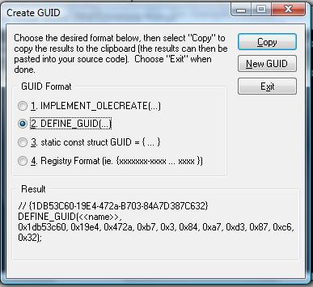
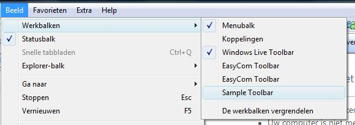
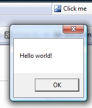

# Internet Explorer Toolbar

## Introduction

Last weekend somebody asked me to write an add-in / add-on for Internet Explorer. I decided to create a new toolbar for him which contained the necessary functions he would need. Not having done this before from Visual Studio I quickly came to the realisation that there is no clear-cut way of doing this quickly. Luckily [Google](http://www.google.com) came to the rescue and provided a vast array of articles related to this topic. Unfortunately there are a few obstacles to overcome in order to whip up a toolbar for IE under Windows Vista and none of the articles I found contained all of the information. In this article I'll show you the steps you'll need to take in order to create your very own toolbar.

Let's get started...

## C++ And The Active Template Library

When looking (read as Googling) for a solution on how to develop a toolbar for Internet Explorer in Visual Studio the search results were dominiated by C++ and ATL. Now my language of choice is C#, fiddling around with C++ and ATL first wasn't desirable.

The Active Template Library (ATL) is a set of template-based C++ classes that simplify the programming of COM objects. You could rely on the Microsoft Foundation Classes (MFC) for this too, but you can view the ATL as a lightweight alternative for quickly creating COM objects.

In order to create a toolbar for Internet Explorer you must use a band object. There are three categories of band objects, namely explorer bars, desk bands and tool bands. A band object is a COM object which implements a bunch of interfaces such as IDeskBand, IPersistStream, IObjectWithSite and so on. This COM object is contained by IE or the shell.

So far for this short introduction on band objects and COM programming. Since this isn't the scope of this article I won't elaborate on it. If you want to learn more about this particular part I suggest the [Band Objects: A beginners tutorial from scratch](http://www.dotnetheaven.com/Uploadfile/mahesh/bands105272005060056AM/bands1.aspx?ArticleID=5d090f52-5725-43a8-8a72-0f8ae3643cdd) article. You just need to know that the toolbar you are going to create is basically a COM object called a band object.

## Using Band Objects In .NET

The interfaces which Explorer requires that a band object needs to implement aren't readily available in one of the .NET type libraries. You have to convert them from C++ to one of the .NET languages. Luckily somebody has already done the "dirty work". The [Band Objects article](http://www.codeproject.com/KB/shell/dotnetbandobjects.aspx) by Pavel Zolnikov on [CodeProject](http://www.codeproject.com/) gives you everything you need. I suggest that you read this article first before continuing. You can download the necessary code from CodeProject which contains a base class aptly called BandObject.

If you want to skip the article on CodeProject then just download the [source code](http://www.codeproject.com/KB/shell/dotnetBandObjects/dotnetBandObjects_src.zip) and build a Release version of the BandObjectLib project and register the resulting BandObjectLib Dll assembly in the Global Assembly Cache (GAC).

This assembly and the assemblies containing your IE add-ons must be registered in the GAC. In order for the .NET framework to find the assemblies which implement a COM object they must be located in the GAC or in the same directory as the client application. Be sure to provide the assembly with a strong name (key pair) before attempting to register it in the cache.

## Interoperability DLL

I converted the solution found on CodeProject to Visual Studio 2008 using the [Visual Studio Conversion Wizard](http://msdn2.microsoft.com/en-us/library/60z6y467.aspx). Afterwards I removed all the projects from the solution except the BandObjectLib project. When attempting to create a Release build I received the following error:

"_Assembly generation failed -- The referenced assembly Interop.SHDocVW doesn't have a strong name._"

The BandObjectLib project contains a reference to the SHDocVw.dll file. Visual Studio creates an Interop.SHDocVw.dll interop assembly and copies this to your project folder (e.g.: \\BandObjectLib\\obj\\Debug\\).

Follow these steps to get rid of this error:

1. Remove the original SHDocVw.dll reference and delete any Interop.SHDocVw.dll files present in your project folder and its subdirectories.
2. Add a reference to the SHDocVw.dll file which is located on your computer.
3. Build the BandObjectLib project. This will generate a new Interop.SHDocVw.dll interoperability assembly.
4. Open the properties for the BandObjectLib project and under the Signing tab make sure it is signed. You can used the provided BandObject.snk file or create your own using the [Strong Name Tool](<http://msdn2.microsoft.com/en-us/library/k5b5tt23(VS.80).aspx>) (sn.exe).

Once this is done you need to add the Interop.SHDocVw.dll assembly to the global assembly cache (GAC).

## The Global Assembly Cache (GAC)

As you may know the Global Assembly Cache (GAC) is a cache in which you can store .NET assemblies which the .NET runtime uses as a central repository. You can store multiple versions of the same assembly in the cache. That's why they need to be strong named as mentioned earlier.

You can register an assembly in the GAC by using the command-line interface tool Gacutil.exe. To install an assembly in the cache just execute the following command:

_gacutil /if NameOfAssembly.dll_

To deinstall an assembly from the cache use this command:

_gacutil /uf NameOfAssembly_

Notice that the .dll extension has been omitted from the previous command.

By default the Gacutil.exe tool isn't known when you call it at the command prompt. You can resolve this by adding its path to the [environment variables](http://lifehacker.com/software/windows-tip/create-your-own-environment-variables-for-quick-folder-navigation-259018.php) (Computer | Properties | Advanced | Environment Variables).

I advise using the Visual Studio Command Prompt instead. Introduced in the .NET Framework 2.0 it automatically sets certain environment variables that allow you access to various .NET Framework tools. It is advisable to run this tool with Administrator credentials. Take a look at [Dave Lloyd's blog](http://objectsharp.com/cs/blogs/dave/archive/2004/02/26/visual-studio-command-prompt.aspx) on how to do so. Although an old article this still holds true on Windows Vista.

## Creating Your Own Toolbar

Once the BandObjectLib assembly has been registered in the GAC you are ready to create you very own toolbar. Create a new Windows Forms Control Library project and call it SampleToolbar. Add it to the solution containing the BandObjectLib class library. Next add a reference to the BandObjectLib assembly which you created earlier. Rename the UserControl1.cs and the UserControl1 class inside it to SampleToolbar.cs and SampleToolbar.

The SampleToolbar class inherits from the BandObject class instead of System.Windows.Forms.UserControl. After changing this the SampleToolbar class should look as follows:

**Listing 1** - SampleToolbar

```csharp
using System.Runtime.InteropServices;
using BandObjectLib;

namespace SampleToolbar
{
    [Guid("88272A6E-9989-4c15-8536-D4F7C4E2D891")]
    public partial class SampleToolbar : BandObject
    {
        public SampleToolbar()
        {
            InitializeComponent();
        }
    }
}
```

As you can see a Guid attribute has been attached to this class. It is a COM component afterall. Use the guidgen.exe tool from the Visual Studio Command Prompt to generate your own or just copy mine.

[](http://msdn2.microsoft.com/en-us/library/ms924300.aspx)

Next switch to the designer for the user control, ehr toolbar and add a toolstrip containing one single button. Double click on the button to add a click event handler and add the following code:

**Listing 2** - Complete SampleToolbar.cs File

```csharp
using System;
using System.Collections.Generic;
using System.ComponentModel;
using System.Drawing;
using System.Data;
using System.Linq;
using System.Text;
using System.Windows.Forms;
using System.Runtime.InteropServices;
using BandObjectLib;

namespace SampleToolbar
{
    [Guid("88272A6E-9989-4c15-8536-D4F7C4E2D891")]
    [BandObject("Sample Toolbar", BandObjectStyle.ExplorerToolbar |
        BandObjectStyle.Horizontal, HelpText = "A sample toolbar with a single button")]
    public partial class SampleToolbar : BandObject
    {
        public SampleToolbar()
        {
            InitializeComponent();
        }

        private void btnHello_Click(object sender, EventArgs e)
        {
            MessageBox.Show("Hello world!");
        }
    }
}
```

As you may have noticed in Listing 2 a new attribute has been applied to the SampleToolbar class. With the BandObject attribute, which is declared in the BandObjectLib library, you can specifiy which type of band object you want. Here I have choosen for a standard horizontal Explorer toolbar.

Now to complete the design part of the toolbar set its Size and MinSize property to "150 (width), 24 (height)". For the last step set the GripStyle property of the Toolstrip to Hidden.

## COM Visible

To get your toolbar integrated into Internet Explorer you will have to add the SampleToolbar Dll assembly to the global assembly cache. You will also have to sign this assembly in order to be able to register it to the GAC. You can use the same snk file of the BandObjectLib project or you can opt to create a new one with the sn.exe tool.

Once registered in the GAC there is one more thing you need to do if you want to use the toolbar in IE, namely you have to register it as a COM server. This is were another command-line interface tool comes to the rescue. The [Assembly Registration Tool](<http://msdn2.microsoft.com/en-us/library/tzat5yw6(VS.80).aspx>) (regasm.exe) will read the metadata in an assembly and will add the necessary entries to the registry to allow COM clients to create .NET Framework classes. Once registered any COM client can use the class as if it were a COM class.

To register the SampleToolbar class within the SampleToolbars Dll assembly as a COM server you need to execute the following command from a Visual Studio Command Prompt:

```sh
_regasm SampleToolbars.dll_
```

But before you do so, make sure to make the types in your assembly visible to COM components. You can do this by setting the ComVisible attribute in the AssemblyInfo.cs file to true.

**Listing 3** - AssemblyInfo.cs File

```csharp
// Setting ComVisible to false makes the types in this assembly not visible
// to COM components.  If you need to access a type in this assembly from
// COM, set the ComVisible attribute to true on that type.
[assembly: ComVisible(true)]
```

If you have already added the SampleToolbars assembly to the GAC without this attribute set to true, then you need to register it again. You need to reregister any assembly with the GAC if you have made any changes to it! You also need to restart Internet Explorer after you have registered any new assemblies to the GAC if you wish to see the changes.

You can unregister the registered types with the following command:

```sh
_regasm /unregister SampleToolbars.dll_
```

Be sure to unregister and reregister the types again after you have changed your add-on. Changing the type (explorer bar, desk band...etc.) for example and not unregistering and reregistering the types will result in weird behaviour when IE loads your add-ons.

After the assembly has been added to the GAC and the toolbar type within it has been registered as a COM server you can access the toolbar in IE. Just start IE and select View > Toolbars and then choose the Sample Toolbar. The screenshot below shows IE 7 in action, though in Dutch.



## Fixing The BandObject

The result of displaying the Sample Toolbar in IE is this:



The toolbar is displayed on the righthand side of the screen and is embedded in the main menu toolbar. Although it works properly and greets the world when you click on the "Click me" button it is still flawed. You can't move the toolbar around, it is stuck in the main menu toolbar. This is pretty annoying and is caused by a bug in the BandObjectLib library.

Open the ComInterop.cs file from the BandObjectLib project and add the following structure.

**Listing 4** - DBIMF Structure

```csharp
/// <summary>
/// A set of flags that define the mode of operation for the band object.
/// </summary>
[Flags]
public enum DBIMF : int
{
    //The band is normal in all respects. The other mode flags modify this flag.
    NORMAL = 0x0001,
    //Windows XP and later
    FIXED = 0x0002,
    FIXEDBMP = 0x0004,
    //The height of the band object can be changed. The ptIntegral member defines
    //the step value by which the band object can be resized.
    VARIABLEHEIGHT = 0x0008,
    //Windows XP and later:
    UNDELETEABLE = 0x0010,
    //The band object is displayed with a sunken appearance.
    DEBOSSED = 0x0020,
    //The band will be displayed with the background color specified in crBkgnd.
    BKCOLOR = 0x0040,
    //Windows XP and later:
    USECHEVRON = 0x0080,
    BREAK = 0x0100,
    ADDTOFRONT = 0x0200,
    TOPALIGN = 0x0400,
    NOGRIPPER = 0x0800,
    ALWAYSGRIPPER = 0x1000,
    NOMARGINS = 0x2000,
}
```

Now you need to locate the DESKBANDINFO structure in the same file and change the type of its dwModeFlags data field from DBIM to the newly added structure type DBIMF. Also change the type of the dwMask field to DBIM. You should wind up with the following revised structure.

**Listing 5** - DESKBANDINFO Structure

```csharp
[StructLayout(LayoutKind.Sequential,CharSet=CharSet.Unicode)]
public struct DESKBANDINFO
{
    public DBIM  dwMask;
    public Point ptMinSize;
    public Point ptMaxSize;
    public Point ptIntegral;
    public Point ptActual;
    [MarshalAs(UnmanagedType.ByValTStr, SizeConst=255)]
    public String    wszTitle;
    public DBIMF dwModeFlags;
    public Int32 crBkgnd;
};
```

If you want to learn more then take a look on MSDN on how the [DESKBANDINFO](<http://msdn2.microsoft.com/en-us/library/bb773255(VS.85).aspx>) structure should be implemented. The last change you need to make is in the GetBandInfo(...) method of the BandObject class which is located in the BandObject.cs File. Assign the following value to the dwModeFlags field of the dbi structure in this method:

**Listing 6** - GetBandInfo(...) method

```csharp
public virtual void GetBandInfo(
    UInt32 dwBandID,
    UInt32 dwViewMode,
    ref DESKBANDINFO dbi)
{
      //... preceded by other code ...

      dbi.dwModeFlags = DBIMF.BREAK;
}
```

It would be handy if you could change the value of the dwModeFlags at design time through a property of the BandObject class using the property grid. However the property grid treats this property as an enumeration and thus you can only select a single field from the drop-down list. So you need to implement your own TypeConvertor which helps you edit bit field properties. Implementing this is beyond the scope of this article, but if you are interested in doing this then I recommend the [Bit Flags Type Convertor article](http://www.vbdotnetheaven.com/UploadFile/write.to.serge/FlagsEnumConverter01042007001118AM/FlagsEnumConverter.aspx) written by Serge Gorbenko. The sources accompagnying this article already contain this type convertor and the BandObject class exposes a property called ViewMode which you can use to tweak the behaviour of the toolbar.

Now that the BandObjectLib library has been fixed it is time to rebuild the entire solution. Afterwards you have to reregister the BandObjectLib and SampleToolbar assemblies for the GAC in order for the changes to become visible.

## Toolstrip Borders

To remove the borders from the toolstrip you have to provide your own renderer. To do this add the following bit of code to the constructor of the SampleToolbar class.

**Listing 7** - Custom Toolstrip Renderer

```csharp
public SampleToolbar()
{
    InitializeComponent();

    this.toolStrip.RenderMode = ToolStripRenderMode.ManagerRenderMode;
    this.toolStrip.Renderer = new NoBorderToolStripRenderer();
}
```

After you have specified that the toolstrip should use its own renderer, you need to define the new toolstrip renderer class. It derives from ToolStripSystemRenderer and overrides the OnRenderToolStripBorder(...) method. This overriden method doesn't do anything since it doesn't have to display any borders. Listing 9 shows you how to create your own renderer.

**Listing 8** - Custom Toolstrip Renderer

```csharp
///
/// ToolStripSystemRenderer that overrides OnRenderToolStripBorder to avoid painting the borders.
///
internal class NoBorderToolStripRenderer : ToolStripSystemRenderer
{
    protected override void OnRenderToolStripBorder(ToolStripRenderEventArgs e) { }
}
```

## Transparency

As you can see from the screenshot above there is one more problem to be solved and that is the fact that the toolbar is not transparent. In order to fix this you need to set the BackColor property of the user control and the toolstrip to transparent. Finally you need to add the following tidbit of code to the BandObject class.

**Listing 9** - Tranparency

```csharp
#region Transparency

[DllImport("uxtheme", ExactSpelling = true)]
public extern static Int32 DrawThemeParentBackground(IntPtr hWnd, IntPtr hdc, ref Rectangle pRect);

protected override void OnPaintBackground(PaintEventArgs e)
{
    if (this.BackColor == Color.Transparent)
    {
        IntPtr hdc = e.Graphics.GetHdc();
        Rectangle rec = new Rectangle(e.ClipRectangle.Left,
            e.ClipRectangle.Top, e.ClipRectangle.Width, e.ClipRectangle.Height);
        DrawThemeParentBackground(this.Handle, hdc, ref rec);
        e.Graphics.ReleaseHdc(hdc);
    }
    else
    {
        base.OnPaintBackground(e);
    }
}

#endregion
```

This was the only working bit of code I could find to get the toolbar transparent. If you know a better way then be sure to inform me.

## Summary

Based on this article you should now be able to create you own Internet Explorer toolbar. It starts off with a brief introduction on C++ and the Active Template Library (ATL) and how to develop add-ons for IE using band objects.

Luckily the "dirty work" was already done and based on the code from the BandObject article on CodeProject several adjustments to it were made in order to fix some problems such as making it "moveable" and applying transparency.

Several side-by issues such as working with the global assembly cache (GAC), interoperability Dll's and COM visibility were also addressed. These not only apply to creating add-ons for Internet Explorer but to a vast array of projects and are sure to come in handy later on.

Credit is due to the author of the original BandObject article and those that supplied the fixes I found on several forums after a lot of Googling. If you have any problems, suggestions or comments be sure to let me know.
